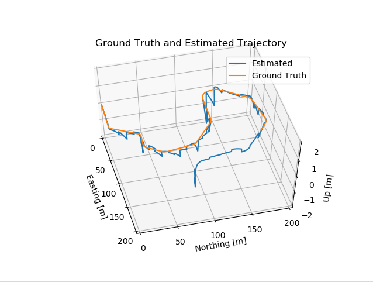
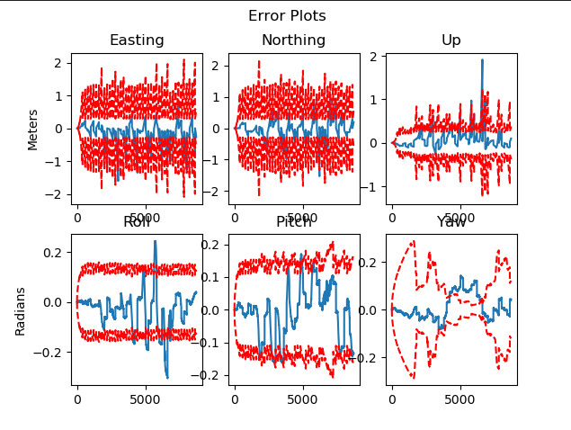

# State-estimation-Autonomous-vehicle
Error State Extended Kalman Filter(ES-EKF) for state estimation of an autonomous vehicle.

## Objectives ##
* develop an Error State Extended Kalman Filter(ES-EKF) for vehicle position tracking using Lidar and GPS measurements.

## how to use ##
* Clone the repository
* Run **es-esk.py** to visualize the tracked trajectory.

## Solution visualization ##

